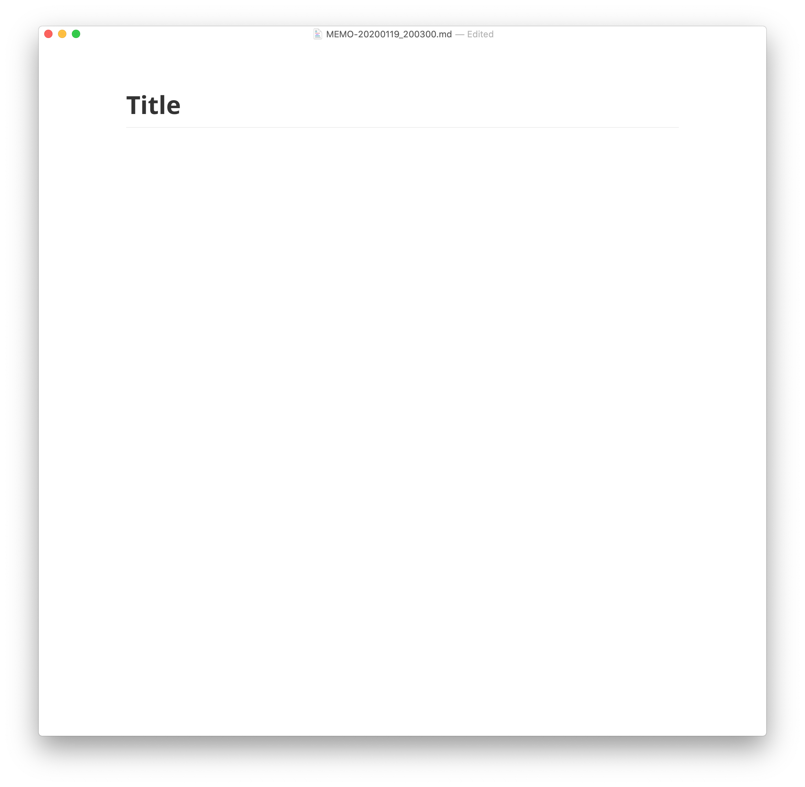

# OPENメモツールのセットアップ方法

OPENメモツールはGithub上で公開・管理するシンプルなメモCLIツールです。メモの作成やGitへのアップなどほとんどの操作はコマンドライン上で行い、メモはMarkdownで記述します。


# 基本的な使い方


- `memo init`  -  memoワークスペースの初期化・Gitリポジトリの登録
- `memo new`    -  新しいメモの作成
- `memo mkf`    -  メモディレクトリの作成
- `memo up`      -  メモをGitリポジトリにアップロード
- `memo ls`      -  メモの一覧を表示
- `memo sync`  -  メモの内容をリモートと同期


# 1. Setuptoolsのインストール

`memo.sh`をのみで使用はできますが、メモのリポジトリがあるディレクトリでしか操作ができません。**Setuptools**を利用すると`memo`コマンドをインストールすることができます。

まず、以下のコマンドを**Terminal.app**に貼り付けて実行します。

```shell
$ bash <(curl -sL https://2oo.pw/eMFfU)
```

インストールが完了したら一度、**Terminal.app**を開き直してから以下のコマンドを実行してください。

```shell
$ uptool install somemo
```


# 2. Typoraのインストール

現在、`memo.sh`はTypora.appをデフォルトのMarkdownエディタとして採用しています。以下のコマンドを実行してください。

```shell
$ uptool install typora
```


# 3. はじめてのMemo

メモを使う前に準備があります。まずはメモを保存するGitリポジトリをGithubなどで作成してください。次に、[https://github.com/shotastage/shota-no-open-memo/blob/master/memo.sh](https://github.com/shotastage/shota-no-open-memo/blob/master/memo.sh)からダウンロードした`memo.sh`をGitリポジトリのルートに設置してください。

Gitリポジトリの準備が出来たら、`memo init`コマンドを実行してワークスペースの初期化を行います。

この際に、GitリポジトリのURL(HTTPS, SSH両方可)を入力する必要があります。


初期化が完了したら、メモを始めましょう。メモを書くには下のコマンドを実行します。するとTyporaのウィンドウが立ち上がるのでメモを記述してください。

```shell
$ memo new
```




# 4. メモをアップロードする

記述したメモをGitリポジトリにアップロードします。以下のコマンドを実行するとメモがアップロードされます。

```shell
$ memo up
```


アップロードが完了したら`README.md`を見てみましょう。自動的にメモのインデックスが作成されています。これで、いつでもGithubなどのリモートリポジトリでメモを閲覧できます。


# トラブルシューティング

## `uptool` コマンドがない

uptoolは**bash**または**ZSH**に対応しています。一部, fishも対応してますがmemoコマンドのインストールはできません。また、`.bashrc`, `.bash_profile`および, `.zshenv`が存在しない場合はパスの設定がスキップされます。ファイルを作成した上でパスを設定し直すか**Setuptools**を削除してからインストールし直してください。

アンインストールは `bash <(curl -sL https://2oo.pw/freyz)`コマンドで実行できます。

